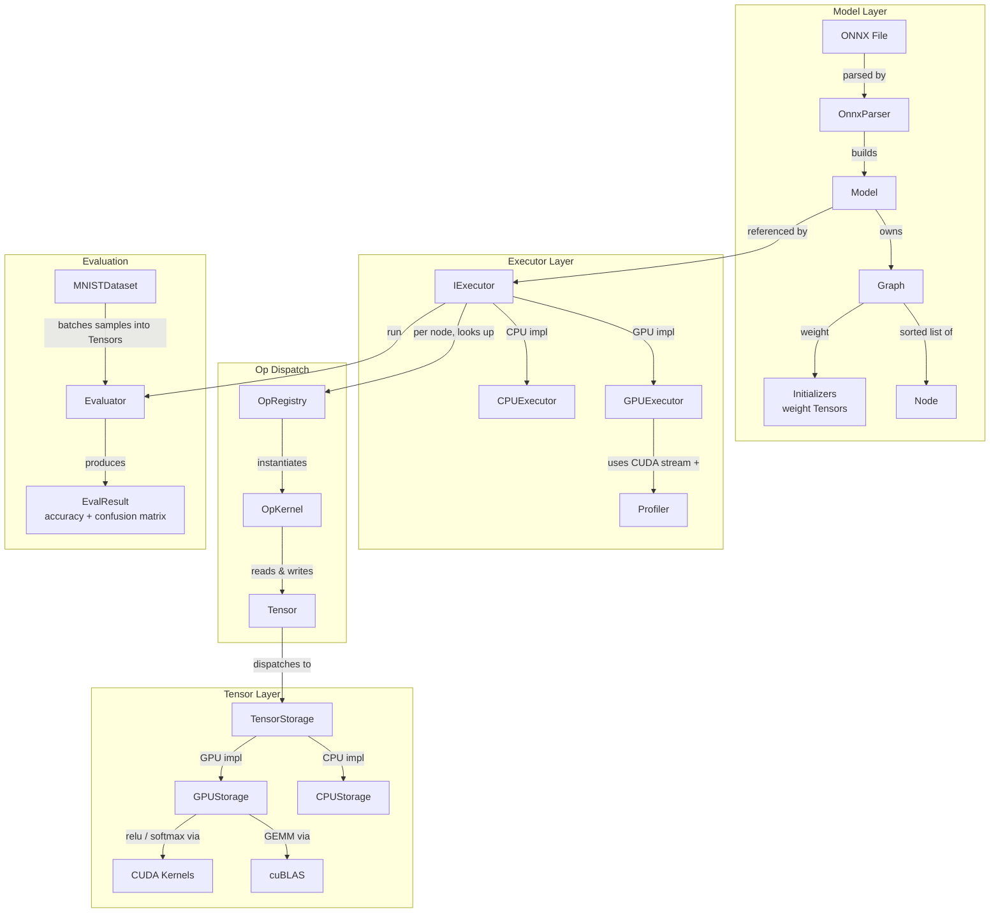

# Tiny NNgine

A toy CUDA-based Neural Network Inference SDK.
## Description

The project is inspired at a high level by PyTorch. The primarily library componenets are: 

* `Tensor` 
	* This is responsible for both holding executing all tensor operations. For the scope of this project, I only support `GEMM`,`softmax` `matsum` operations. 
		* This Tensor object contains a `TensorStorage` interface class, which actually holds the data as a flat vector and dispatches operation to CPU and GPU depending on the derived type (eg. `CPUStorage` and `GPUStorage`) 
* `Model`class
	* Responsible for loading in a `model.onnx` file and generating the underlying `Graph` object. This `Graph` is a topologically sorted DAG, which each `Node` represent an operation in the NN model network
* `Executor` class
	* This is responsible for iterating through the `Model`'s `Graph` and executing each operation
* `Evaluator` class 
	* Runs the model over a dataset in batches, computes accuracy, and builds a confusion matrix.


## Architecture



## Getting Started

### Dependencies

This application is assumed to run on a Linux machine with a CUDA-capable GPU. Tested on NVIDIA sm_75 (GTX 1650) and sm_61 (GTX 1080).

**Build requirements:**
- CMake ≥ 3.17
- GCC (C++17 for host code)
- CUDA Toolkit ≥ 10.1 (nvcc; device code compiled as C++14)
- Protobuf (system install, e.g. `libprotobuf-dev` + `protobuf-compiler`)
- GoogleTest — fetched automatically via CMake `FetchContent` (requires internet access at configure time)

**Python requirements** (for ONNX model generation only):
- Python ≥ 3.8
- `torch`, `torchvision` (PyTorch)
- `onnx`
- `click`

Install Python dependencies:
```sh
pip install torch torchvision onnx click
```

Install system dependencies (Debian/Ubuntu):
```sh
sudo apt install cmake build-essential libprotobuf-dev protobuf-compiler
```

### Build

Run CMake build command
```sh
  mkdir -p build && cd build
  cmake .. -DCMAKE_BUILD_TYPE=Release
  make -j$(nproc) tinyinfer_demo
```

### Executing program

Generate a ONNX model
```sh
cd tools/
poetry run python generate_mnist_onnx.py training --output mnist_fc.onnx --data-dir ./data --epochs 5
```

 Demo application to load model, data and run inference
```sh
  ./build/tinyinfer_demo \
    -m tools/mnist_fc.onnx \
    -i tools/data/MNIST/raw/t10k-images-idx3-ubyte \
    -l tools/data/MNIST/raw/t10k-labels-idx1-ubyte \
    -b 64 # batch size to use for inference

```
## Authors

* Komel Merchant 

## License

This project is licensed under the AGPL License - see the LICENSE.md file for details

## Acknowledgments

* Inspired by [PyTorch](https://pytorch.org/)