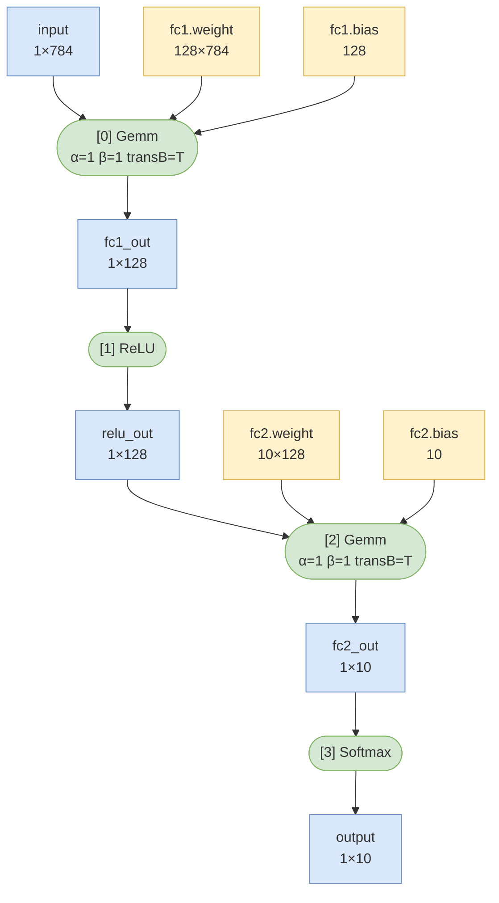

# Project Proposal

**Student Name:** Komel Merchant
**Date:** 02/24

---

```
 ███████████  ███                        ██████   █████ ██████   █████         
░█░░░███░░░█ ░░░                        ░░██████ ░░███ ░░██████ ░░███          
░   ░███  ░  ████  ████████   █████ ████ ░███░███ ░███  ░███░███ ░███   ███████   ███                     
    ░███    ░░███ ░░███░░███ ░░███ ░███  ░███░░███░███  ░███░░███░███  ███░░███  ░░░                      
    ░███     ░███  ░███ ░███  ░███ ░███  ░███ ░░██████  ░███ ░░██████ ░███ ░███  ████  ████████    ██████ 
    ░███     ░███  ░███ ░███  ░███ ░███  ░███  ░░█████  ░███  ░░█████ ░███ ░███ ░░███ ░░███░░███  ███░░███
    █████    █████ ████ █████ ░░███████  █████  ░░█████ █████  ░░█████░░███████  ░███  ░███ ░███ ░███████ 
   ░░░░░    ░░░░░ ░░░░ ░░░░░   ░░░░░███ ░░░░░    ░░░░░ ░░░░░    ░░░░░  ░░░░░███  ░███  ░███ ░███ ░███░░░  
                               ███ ░███                                ███ ░███  █████ ████ █████░░██████ 
                              ░░██████                                ░░██████  ░░░░░ ░░░░ ░░░░░  ░░░░░░  
                               ░░░░░░                                  ░░░░░░  


```

---

## Objective

_In 2–4 sentences, describe what you are building and what problem or goal it addresses. Be specific about the computational task you plan to accelerate or implement on the GPU._

My plan is to create a basic TensorRT-Like Inference-only Engine. The Program will primiarly be written in C++ while the core low-level computations will be carried out in CUDA. The Engine will be able to consume an ONNX file containing a simple pretrained model (I will aim for usin a simple MLP trained to predict digits from the MNIST dataset. This ONNX file will be generated from PyTorch.

### Public API Sketch

``` c++

#include "tinyinfer/tinyinfer.h"

int main() {
    // ── 1. Load Data ──────────────────────────────────────────────
    
    MNISTLoader loader("path/to/mnist/");
    
    // Returns a simple struct, no GPU involvement yet
    MNISTDataset test_set = loader.load_test();
    
    // Single sample access
    MNISTSample sample = test_set[0];
    // sample.image  → float[784], normalized to [0, 1]
    // sample.label  → int, 0-9
    
    // Or grab a batch
    std::vector<MNISTSample> batch = test_set.get_batch(0, 32);
    
    
    // ── 2. Load Model ─────────────────────────────────────────────
    
    Model model = Model::load("mnist_fc.onnx");
    
    // Inspect before running if you want
    model.print_graph();
    // > [0] Gemm        input(1x784) weight(128x784) bias(128)  → fc1_out(1x128)
    // > [1] Relu        fc1_out(1x128)                          → relu_out(1x128)
    // > [2] Gemm        relu_out(1x128) weight(10x128) bias(10) → fc2_out(1x10)
    // > [3] Softmax     fc2_out(1x10)                           → output(1x10)
    
    
    // ── 3. Build Executor ─────────────────────────────────────────
    
    ExecutorConfig cfg;
    cfg.device_id        = 0;
    cfg.precision        = Precision::FP32;
    cfg.enable_profiling = true;
    
    Executor executor(model, cfg);
    
    
    // ── 4. Single Image Inference ─────────────────────────────────
    
    // Upload one sample to device
    Tensor input = Tensor::from_host(
        sample.image,                              // float*
        TensorDesc{{1, 784}, DataType::FLOAT32}
    );
    
    std::vector<Tensor> outputs = executor.run({input});
    
    // outputs[0] is still on device — pull back to host
    float probs[10];
    outputs[0].to_host(probs);
    
    int predicted = std::max_element(probs, probs + 10) - probs;
    
    std::cout << "Predicted: " << predicted 
              << "  Ground truth: " << sample.label << "\n";
    
    
    // ── 5. Batched Inference ──────────────────────────────────────
    
    // Stack batch into a single contiguous float buffer
    std::vector<float> batch_data = test_set.get_batch_flat(0, 32);
    //  shape: [32, 784]
    
    Tensor batch_input = Tensor::from_host(
        batch_data.data(),
        TensorDesc{{32, 784}, DataType::FLOAT32}
    );
    
    auto batch_outputs = executor.run({batch_input});
    // batch_outputs[0] shape: [32, 10]
    
    // Convenience helper — pulls to host and returns predicted class per sample
    std::vector<int> predictions = batch_outputs[0].argmax(/*dim=*/1).to_host_vec<int>();
    
    
    // ── 6. Evaluate Accuracy ──────────────────────────────────────
    
    EvalResult result = Evaluator::run(
        executor,
        test_set,
        EvalConfig{.batch_size = 64}
    );
    
    std::cout << "Accuracy: " << result.accuracy  << "\n";   // e.g. 0.976
    std::cout << "Avg latency: " << result.avg_latency_ms << "ms\n";
    
    result.confusion_matrix.print();
    
    
    // ── 7. Profiling ──────────────────────────────────────────────
    
    executor.get_profile().print();
    // > Op            Time(ms)   % Total
    // > Gemm          0.042      61.3%
    // > Relu          0.008       9.1%
    // > Gemm          0.016      23.4%
    // > Softmax       0.005       6.2%
    // > Total         0.071     100.0%
    
    
    return 0;
}
```


### MNIST Graph Structure



> **Blue** — activations (`value_map_`)  &nbsp; **Green** — op nodes &nbsp; **Yellow** — initializers (`graph_.initializers`)

### Necessary Components

| Module | Files | Notes |
|---|---|---|
| Tensor | `include/tinyinfer/tensor.h`, `src/tensor.cpp` | Core GPU buffer abstraction; owns device memory via `shared_ptr` with a custom `cudaFree` deleter; provides H2D/D2H copy, `argmax`, and shape metadata |
| Graph | `include/tinyinfer/graph.h`, `src/graph.cpp` | Holds a topologically-sorted `vector<Node>` and a name-keyed map of weight tensors (initializers); mirrors ONNX value naming to avoid a translation layer |
| ONNX Parser | `src/onnx_parser.cpp` | Internal module (no public header); parses `onnx::ModelProto` via protobuf, maps op strings to `OpType` enum, uploads initializer tensors to GPU |
| Model | `include/tinyinfer/model.h`, `src/model.cpp` | Public entry point for loading an ONNX file; owns the `Graph`; exposes `print_graph()` and a const reference to the graph for the Executor |
| Op Registry | `include/tinyinfer/op_registry.h`, `src/op_registry.cpp` | Singleton factory mapping `OpType` → `OpKernel`; each op `.cpp` file self-registers at static-init time |
| CUDA Kernels | `src/ops/gemm_kernel.cu`, `src/ops/relu_kernel.cu`, `src/ops/softmax_kernel.cu` | Pure CUDA kernel implementations; Gemm uses shared-memory tiling; Softmax uses row-wise log-sum-exp with `__syncthreads` reductions |
| Op Wrappers | `src/ops/gemm_op.cpp`, `src/ops/relu_op.cpp`, `src/ops/softmax_op.cpp` | Thin `OpKernel` subclasses; resolve tensor pointers from `KernelContext` and launch the corresponding `.cu` kernel |
| Executor | `include/tinyinfer/executor.h`, `src/executor.cpp` | Iterates graph nodes, resolves the value map, dispatches kernels via OpRegistry, manages a persistent CUDA stream and lazy intermediate buffer allocation |
| Profiler | `include/tinyinfer/profiler.h`, `src/profiler.cpp` | Wraps `cudaEvent_t` pairs around each kernel launch; resolves elapsed time after `cudaStreamSynchronize` and prints a per-op timing table |
| MNIST Loader | `include/tinyinfer/mnist_loader.h`, `src/mnist_loader.cpp` | Reads IDX binary format with `fread`; normalizes pixel values to `[0,1]`; provides single-sample and flat-batch access; no GPU involvement |
| Evaluator | `include/tinyinfer/evaluator.h`, `src/evaluator.cpp` | Stateless; drives `Executor::run()` in configurable batches, calls `argmax(1)` on outputs, accumulates accuracy and a 10×10 confusion matrix |

---

## Programming Platform

- [x] CUDA
- [ ] OpenCL


---

## Hypothesis / Expected Outcome

**Performance**

The two metrics I am optimizing for are accuracy and throughput.
- Accuracy should be numerically identical to the source PyTorch model (within FP32 tolerance), confirming correctness of the CUDA kernels.
- Inference speed should exceed PyTorch CPU JIT and be competitive with (though likely slightly below) PyTorch CUDA JIT, since cuDNN and TorchScript carry additional optimizations we will not replicate.

**Technical Challenges**

- Implementing the ONNX protobuf parser from scratch — will scope it to the minimum set of fields needed for our four-op graph.
- Designing the graph and value-map execution model correctly before writing any kernels.
- Per-kernel shared-memory optimization for Gemm (tiled SGEMM) and numerically stable Softmax.

**Success Criteria**

- ≥ 97% accuracy on the full MNIST test set (10,000 samples).
- Per-op profiling table showing Gemm, ReLU, Gemm, Softmax breakdown.
- Latency comparison table against PyTorch CPU and CUDA baselines.

---

## Deliverables Overview

| Deliverable | Description |
|---|---|
| Code | Working GPU implementation of the proposed project |
| Video Presentation | Class presentation recorded as a video |
| Final Report | Written report covering design, implementation, and results |
| Code Review (Host) | Host one code review of your own code |
| Code Reviews (Peer) | Participate in at least two other students' code reviews |

---

